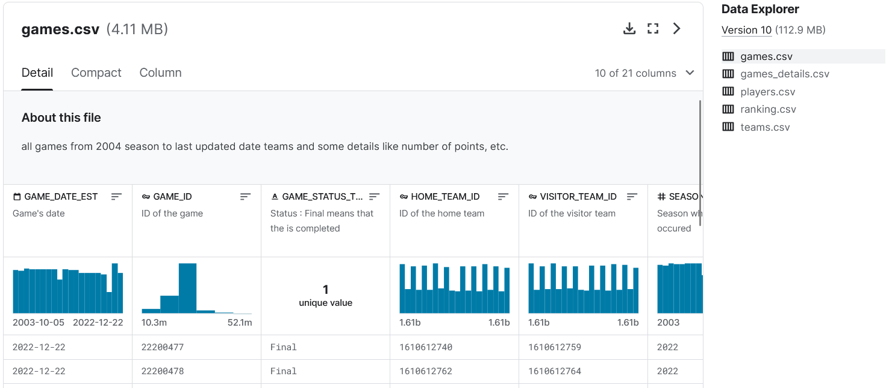
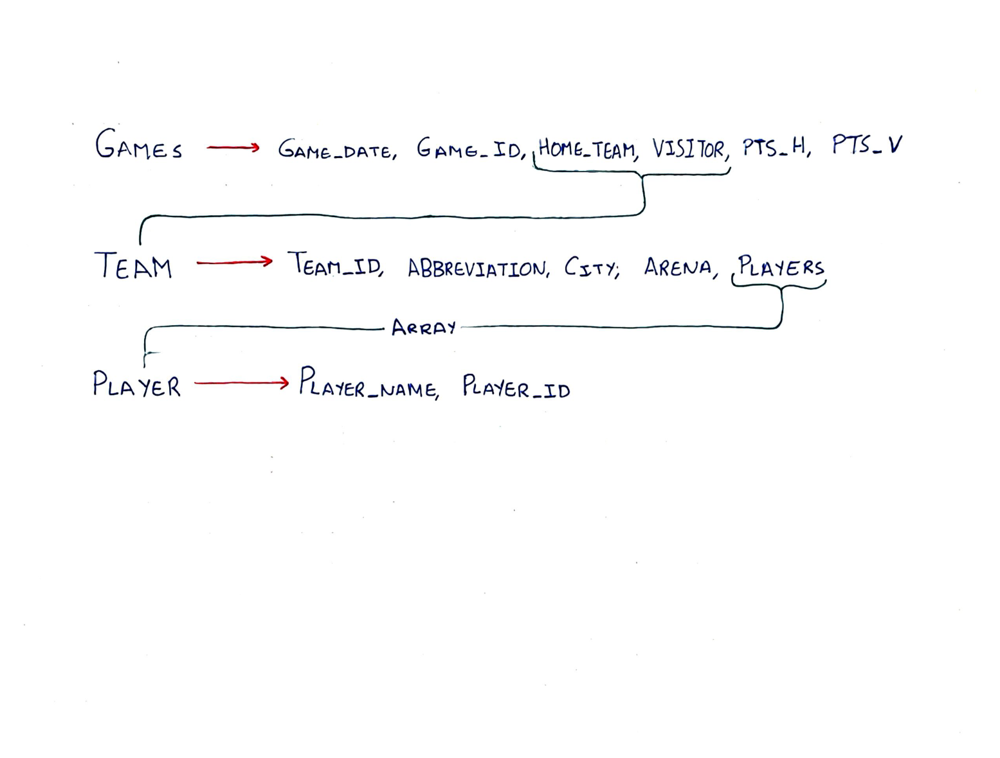

# Datu atzipeneko 2. ebaluaketako bakarkako lana. REST API baten garapena.

## Aurkibidea
1. [Sarrera](#sarrera)
2. [Datu basea](#db)
3. [Rest API-a](#rest-api)
4. [Dokumentazioa](#dok)
5. [Erabilera](#erabilera)
6. [Oharrak](#oharrak)

## Sarrera 
Ebaluazioa honetan ikasi dugun materia berrian (rest API-ak Spring erabilita, db ez-erlazionalak, docker, dokumentazioa Swagger erabilita, ...) oinarrituta, proiektu hau garatu behar izan dugu.

Proiektuaren **helburu nagusia**- Mongo datu-base bateko datuak atzitzeko Rest API bat garatzea izango da, Spring Java teknologia erabiliz.

### Datuak

Mongo datu-baseko dokumentuak (500 baino gehiago) kanpo iturriren batetik hartutakoak izango dira eta sakontasun maila bat eduki beharko dute gutxienez. Hau da, derrigorrez eremuetako bat arraya edo json objektua izango da. Zenbat eta datu mota gehiago, zenbat eta dokumentuen sakontasuna handiagoa, hobe, beti ere informazioa zentzuzkoa, interesgarria eta esanguratsua bada. Datuen hasierako karga ez da eskuz egingo baizik eta:
- .csv edo .json fitxategiak zuzenean Mongotik inportatuz
- Java programa bat erabiliz. Kasu honetan:
    - Fitxategi bat izan daiteke iturria (.csv, .xml, .json) edo baita Rest Api bat.
    - Datuak jasotako moduan txertatu daitezke edo moduren baten aldatu-osatu.

### Rest zerbitzua

Mongo Driver Sync liburutegia erabiliko da Mongo datuak atzitzeko eta gutxienez endpoint bat prestatu behar da mota bakoitzetik (GET, POST, PUT, DELETE). Swagger 
- Open Api Documentation bidez argitaratuko da API, beraz, lau koloreak ikusi behar dira, derrigorrez. Zenbat eta endpoint gehiago eta konplexuagoak hobe, baldin eta zentzuzkoak, interesgarriak eta anitzak badira.

### Docker

Ez da derrigorra Docker erabiltzea baina puntu gehigarriak lortu daitezke kasu hauetan: 
- Mongo zerbitzaria ordenagailu lokalean zuzenean instalatu beharrean docker kontainer batean martxan jarriz. 
- Proiektu osoa kontainerizatuz.

### Dokumentazioa

Javadoc eta bestelako oharrak erabiliz Java kodigoa ondo komentatuta egoteaz gain eta Swaggerrak funtzionatzeaz gain proiektuaren README.md fitxategian zera azaldu beharko da:

- Datuak: Zein den zerbitzuaren datuen hasierako iturria eta zein prozesu jarraitu den datu horiek Mongo zerbidore lokalera ekartzeko.

- Rest zerbitzua: Swaggerraren “screenshot”a, eta endpointen taula (Mota, EndPointa eta Emaitza zutabeekin).

- Mongo: Zerbitzari, datu-base, kolekzio eta dokumentuen inguruko zehaztasunak.

- Java proiektua(k): Rest zerbitzuaren klase diagrama eta zein modutan jarri daitekeen martxan. Mongora datuak Java erabilita ekarri badira programa horri buruzko zehaztasunak baita. Lehen mailako Programazioa ikasgaia pendiente badaukazu, klase diagrama ahalik eta zehatzena egitea komeni zaizu, bestela, elementu nagusien diagrama nahikoa izango da.

- Docker: Erabili bada, nola erabili den.

Horrez gain bideo bat prestatu daiteke, gehienez 2 minutukoa zerbitzuaren funtzionamendua azalduz. Ez da derrigorra, baina puntuak eman ditzake.

## Datu basea 
Ikasi bezala, datuak mongo datu-bae batetik kudeatuko ditugu. Horretarako Mongo zerbitzariaren MongoDBCompass GUI ofiziala erabiliko ditugu lana erosoago egiteko.

Gure ekipo lokalean bertan, software hau erabiliko dugu datubase eta kolekzioa ezberdinak kudeatzeko eta bistaratzeko/ikusteko.

Baldintzetan adierazten bezala, datu asko erabili behar dira, eta ahal den neurrian, datu konplexuak. Hori dela eta, denbora batez bilatzen egon ostean, interesgarri izan ahal zen dataset <a href="https://www.kaggle.com/datasets/nathanlauga/nba-games?select=teams.csv">hau</a> topatu nuen **Kaggle** web-orrian.

Dataset honetan, datu/taula gehigi agertzen ziren, datuak ez ziren konplexuegiak, eta gainera, datuak csv formatoan daude (ez du baimentzen datu konplexuko eremuak definitzen):

Gauzak horrela, 1. ebaluazioan ikasitakoarekin datuen eraldaketarako programa bat garatzea erabaki nuen, helburua hurrengoa zen:
- Game modeloaren **taula murriztu eta eraldatu** batekin gelditzea.
- Game modeloaren ..._TEAM_ID erabili beharrean, zuzenean, **Team objektu bat** gordeko du, teams.csv fitxategitik hartutako eremu erabilgarrienekin.
- Team objektuari eremu berri bat gehitu, non, Team horretako **Player objektu** guztiak gordeko dira **array baten** (players.csv fitxategitik lortuta).
- Hau guztia lortu ostean, lortutako emaitz finala JSON moduko fitxategi bate gorde behar da, eta ez CSV formatuan.

Behin dataset finala lortuta, MongoDBCompass software-an, datubase berria sortu behar da **nba** izenarekin, eta aldi berean, honen barruan, **games** kolekzioa sortuko dugu. Kolekzio honetan, lortutako JSON fitxategia importatuko dugu, erabiliko dugun datubasea definitzen.

## Rest API-a 
Behin datuak izanda, rest API-aren garapenarekin hasi gaitezke.

Lehendabizi egin beharreko lana, erabiliko ditugun modeloak definitzea da (nire kasuan ere erabilik ditugu datuen eraldaketarako programan): **Player, Team, Game, GameRepository, eta MongoGameRepository**.

Ondoren, Spring-eko konfigurazioa definitzea da SpringConfiguration fitxategiaren bitartez.

Azkenik, MainController programa garatu behar da, rest API-ren endpoint desberdinak definitzeko, eta bakoitzean egin beharreko funtzioa garatzeko. Nire rest API-an garatutako aukerak, eta endpoint-ak hauek dira:

| Endpoint  | Funtzioa |
| ------------- | ------------- |
| localhost:8081/games/all| Game guztien erregistroak erakutsi.|
| localhost:8081/games/specificgameById?gameId=123| Game zehatz bat erakutsi id-an oinarrituta.|
| localhost:8081/games/specificgameByDate?date=22-10-2020| Data hori duten game-ak erakutsi.|
| localhost:8081/games/deleteGameById?gameId=123| Game zehatz bat ezabatu id-an oinarrituta.|
| localhost:8081/games/deleteGameByDate?date=22-10-2020| Data hori duten game-ak ezabatu.|
| localhost:8081/games/updatepoints?gameId=123&ptsHome=100&ptsVisitor=200| Game baten puntuazioak aldatu.|
| localhost:8081/games/updateDate?gameId=123&date=22-10-2020| Game baten data aldatu.|
| localhost:8081/games/createPlayer?gameId=123&team=0&playerId=5kl879s&playerName=Juan| Game zehatz baten jokalari berri bat gehitu.|
| localhost:8081/games/newGame?date=22-10-2020&homeTeamAbbr=ABU&visitorTeamAbbr=PAO&ptsHome=100&ptsVisitor=150| Game baten oinarrizko erregistroa sortu|

## Dokumentazioa 
Proiektu osoa dokumentatzeko, hurrengo iturriak erabili ditut:
- **Javadoc**: Java komentarioak egiten programan zehar honen funtzionamendua azaltzen.
- **Swagger**: Rest-API-a "bere kabuz" dokumentatzeko (zerbitzu bezala).
- **README**: Readme fitxategi honetan proiektuaren dokumentazio orokorra ondo azaltzen, errepositorioan era bisual batean agertzeko.

## Erabilera 
REST API honen proiektu ososa martxan jartzeko eta funtzio guztiak erabili ahal izateko jarraitu behar diren pausoak hurrengoak dira:

1. **commands** carpeta barruan dagoen **GenerateFinalJson.java** fitxategian, `main()` metodoan `transformAndWriteJSON()` metodora pasatu behar diren ruta absolutuak egokitu proiektua exekutatuko den ekipora.
2. Ondoren, **GenerateFinalJson.java** fitxategia exekutatzeko prest egongo da, beraz, hori egin. Horrela, **resources/data_source** direktorioan **definitive.json** fitxategia sortuko da.
3. Behin **definitive.json** fitxategia izanda, gure mongo zerbitzarian (MongoDBCompass, Atlas, edo MongoShell bidez) DB berria sortuko dugu **nba** izenarekin, eta honen barruan egongo den kolekzio bakarra **games** izango da. Azken honetan, sortutako **definitive.json** inportatu behar da.
4. Aurreko pauso guztiak jarraituta, REST API-a martxan izateko falta den urrats bakarra, **MainProgram** exekutatzea da.

Hona hemen emaitzaren exekuzio adibidea, bideoa ikusteko (mugitu edota gelditu ahal izateko, gif-an klikatu):

### Post + Get

### Put

### Delete

## Oharrak 
- Datuak eraldatzeko garatu dudan programan (**commands/GenerateFinalJSON.java**), ruta absolutuak erabili ditut, aukera egokiena eta erozoena ez dela jakin arren, ruta erlatiboak erabilita hainbat arazo eduki ditudalako
- Egokiena, sortzen den JSON definitibo hori errepositorioan gordetzea izan arren, erabili ditudan dataset-ak handiegiak direnez, git errepositorioak ez du ahalbidetzen holakorik igotzen.